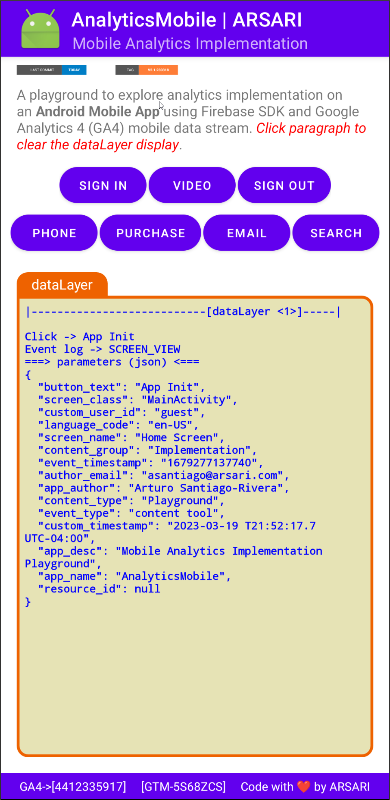

# AnalyticsMobile

[](https://www.github.com/arsari/AnalyticsMobile/tags "Go to AnalyticsMobile Releases-Tags")&nbsp;&nbsp;&nbsp;&nbsp;[](LICENSE "Click to see License")<br>[](https://arsari.github.com/AnalyticsWeb "Click Here to Visit the Project!")

## Mobile Analytics Implementation Playground

### Table of Contents

<!-- Start Document Outline -->

* [Introduction](#introduction)
* [Fundamentals: Setup Firebase SDK and Analytics SDK](#fundamentals-setup-firebase-sdk-and-analytics-sdk)
* [Tagging Implementation](#tagging-implementation)
	* [Screen View Event](#screen-view-event)
	* [General Events](#general-events)
	* [Purchase Event](#purchase-event)
	* [Error Events](#error-events)
	* [Video Events](#video-events)
* [GTM Setup](#gtm-setup)
* [Reference Documentation](#reference-documentation)

<!-- End Document Outline -->

### Introduction

Google Analytics 4 (GA4) is a powerful analytics tool that enables to track user interactions and behaviors on our mobile app. Implementing GA4 on our mobile app requires a few steps:

* Set up a GA4 property in the Google Analytics interface.
* Install the Google Analytics for Firebase SDK in the mobile app.
* Configure the app to use the Firebase SDK, including registering the app with Firebase.
* Enable the GA4 property for our Firebase project.
* Update our app's code to use the GA4 tracking code.

This is self playground of analytic implementation on an Android Mobile App using Firebase SDK, GTM, and GA4 mobile data stream that allows to explore the implementation of:

- Setup of Firebase SDK Analytics tracking in the Android Mobile App ([Add Firebase to your Android Project](https://firebase.google.com/docs/android/setup))
- Setup of GTM in the Android Mobile App to track different 3rd party tags
- dataLayer objects firing and analyzing user interactions in GA4 ([Read more about Google Analytics for Firebase](https://firebase.google.com/docs/analytics))

<div style="text-align: center;">
    
    <p><em>Figure 1 - AnalyticsMobile App Screenshot</em></p>
</div>

This implementation is based on JAVA programming language with the following Project Structure:

- Project
  - Android Gradle Plugin Version: 7.4.0
  - Gradle Version: 7.5
- Modules
  - Properties
    - Compile SDK Version: 33
    - Source Compatibility: $JavaVersion.VERSION_11
    - Target Compatibility: $JavaVersion.VERSION_11
  - Default Config
    - Target SDK Version: 33
    - Min SDK Version: 24
- Built Variants
  - Minify Enabled: false

### Fundamentals: Setup Firebase SDK and Analytics SDK

In Android Studio, first click the `Android` label to open the drop-down menu for the project navigator view, and choose Project to see the full root directory structure of the project. Expand the project directory and the **/app/** folder within, and drag-and-drop the `google-services.json` file, downloaded from the Firebase console, into the **/app/** directory.

1. Look for **<project_name>/build.gradle** file, opened, and add the following before the plugins object, if any: 

```java
buildscript {
  repositories {
    // Make sure that you have the following two repositories
    google()  // Google's Maven repository
    mavenCentral()  // Maven Central repository
  }

  dependencies {
    // Add the dependency for the Google services Gradle plugin
    classpath 'com.google.gms:google-services:4.3.14'
  }
}
```

> _Note! If a newer version is available, this will be indicated by a yellow highlight around the `classpath` code._

1. Look for **<project_name>/app/build.gradle** file and add the following: 

```java
plugins {
    ...

    // Firebase: Add the Google services Gradle plugin
    id 'com.google.gms.google-services'
}

dependencies {
    ...

    // Firebase: Import the Firebase BoM
    implementation platform('com.google.firebase:firebase-bom:31.2.3')
    // Firebase Analytics (Java)
    implementation 'com.google.firebase:firebase-analytics:21.2.0'
    // TODO: Add the dependencies for Firebase products you want to use
      /**
       * When using the BoM, don't specify versions in Firebase dependencies
       * Add the dependencies for any other desired Firebase products
       * https://firebase.google.com/docs/android/setup#available-libraries
       */

    // GTM: Import the tag manager services
    implementation 'com.google.android.gms:play-services-tagmanager:18.0.2'
}
```

> _Note! By using the Firebase Android BoM, your app will always use compatible versions of Firebase Android libraries. If there are newer versions of the Firebase BOM, Firebase Analytics, and Google Tag Manager dependencies available, this will be indicated with a yellow highlight around the `implementation` statements._

GTM was added as a dependency in the script above but the container need to be configure. See [GTM setup](#gtm-setup) for additional steps.

1. Declare the `com.google.firebase.analytics.FirebaseAnalytics` object at the top of your activity:

```java
private FirebaseAnalytics mFirebaseAnalytics
```

1. Initialize it in the `onCreate()`` method:

```java
mFirebaseAnalytics = FirebaseAnalytics.getInstance(this);
```

### Tagging Implementation

After you have created a FirebaseAnalytics instance, you can begin to log events with the `.logEvent()` method. The event `dataLayer` array-object or `Bundle` is send to GA4 using the statement `FirebaseAnalytics.logEvent(EVENT_NAME, EVENT_PARAMS_BUNDLE)`.

Firebase SDK have some events and parameters out-of-box which is highly recommended to use before creating custom events and parameters. The out-of-box events and parameters will be prefixed with `FirebaseAnalytics.Event.NAME_OF_EVENT` and `FirebaseAnalytics.Param.NAME_OF_PARAMETER`. Send events along with their prescribed parameters, to ensure maximum available detail in our reports and to benefit from future features and integration's as they become available. We can find implementation details for recommended event types in the following locations:

- Recommended events: see the [com.google.firebase.analytics.FirebaseAnalytics.Event](https://firebase.google.com/docs/reference/android/com/google/firebase/analytics/FirebaseAnalytics.Event) class reference.
- Prescribed parameters: see the [com.google.firebase.analytics.FirebaseAnalytics.Param](https://firebase.google.com/docs/reference/android/com/google/firebase/analytics/FirebaseAnalytics.Param) reference.

User ID and others user properties are set using `FirebaseAnalytics.setUserId(USER_ID)` and `FirebaseAnalytics.setUserProperty(EVENT_NAME, STRING_VALUE)`. For more information see [Set User Properties](https://firebase.google.com/docs/analytics/user-properties?platform=android) and [Set User ID](https://firebase.google.com/docs/analytics/userid#android).

On our implementation, we create a `userAuthenticated(BOOLEAN_VALUE)` method which fires the corresponding user properties attributes that describes the app-user. After setting a user ID, all future events will be automatically tagged with this value.

```java
mFirebaseAnalytics.setUserId(ui);
mFirebaseAnalytics.setUserProperty("logged_in", "true");

or

mFirebaseAnalytics.setUserProperty("logged_in", "false");
```

To facilitate identified user actions by their UserID, a `custom_user_id` custom dimension **event**, not _user_, is implemented as a global parameter in GA4 which allow to use it in the Explorer reports (`user_id` is a reserved dimension that is only available for the GA4 User Explorer report). The `custom_user_id` was set as _event_ in GA4 because if it is set as a user property we need to fire it using `mFirebaseAnalytics.setUserProperty()` method and could not be append to each fired event.

The tagging implementation for events log consider the followings user actions (ui interactions), system events (content tools), and errors based on a app resource click and a `setOnClickListener()` method to fire the corresponding **events**:

> _Note! Events predefined in Firebase has been capitalized._

| User Action   | Event                | Type             | Parameters                                                                                                                          | GA4 Scope                                                                     | GA4 Definitions                                                                                                        |
| ------------- | -------------------- | ---------------- | ----------------------------------------------------------------------------------------------------------------------------------- | ----------------------------------------------------------------------------- | ---------------------------------------------------------------------------------------------------------------------- |
| Screen View   | screen_view          | content tool     | SCREEN_NAME<br>SCREEN_CLASS<br>app_name<br>app_desc<br>app_author<br>author_email<br>content_group<br>content_type<br>language_code | Event<br>Event<br>Event<br>Event<br>Event<br>Event<br>Event<br>Event<br>Event | Predefined<br>Predefined<br>Dimension<br>Dimension<br>Dimension<br>Dimension<br>Predefined<br>Predefined<br>Predefined |
| Sign In       | login                | user interaction | method                                                                                                                              | Event                                                                         | Predefined                                                                                                             |
| Sign In       | login_error          | content tool     | error_message<br>toast_impression                                                                                                   | Event<br>Event                                                                | Dimension<br>Dimension                                                                                                 |
| Email         | generate_lead        | user interaction | contact_method<br>CURRENCY<br>VALUE                                                                                                 | Event<br>Event<br>Event                                                       | Dimension<br>Predefined<br>Predefined                                                                                  |
| Outbound Link | outbound_link        | user interaction | link_id<br>link_url<br>link_text<br>outbound                                                                                        | Event<br>Event<br>Event<br>Event                                              | Predefined<br>Predefined<br>Predefined<br>Predefined                                                                   |
| Phone         | generate_lead        | user interaction | contact_method<br>CURRENCY<br>VALUE                                                                                                 | Event<br>Event<br>Event                                                       | Dimension<br>Predefined<br>Predefined                                                                                  |
| Purchase      | purchase             | user interaction | TRANSACTION_ID<br>AFFILIATION<br>CURRENCY<br>VALUE<br>TAX<br>SHIPPING<br>COUPON<br>ITEMS                                                                                 | Event<br>Event<br>Event<br>Event<br>Event<br>Event<br>Event<br>Event                                     | Predefined<br>Predefined<br>Predefined<br>Predefined<br>Predefined<br>Predefined<br>Predefined<br>Predefined                                                     |
| Search        | search_dialog_opened | user interaction |                                                                                                                                     |                                                                               |                                                                                                                        |
| - _ok_        | search               | user interaction | search_term                                                                                                                         | Event                                                                         | Predefined                                                                                                             |
| - _cancel_    | search_dialog_closed | user interaction |                                                                                                                                     |                                                                               |                                                                                                                        |
| Search        | search_error         | content tool     | error_message<br>toast_impression                                                                                                   | Event<br>Event                                                                | Dimension<br>Dimension                                                                                                 |
| Video         | video_start          | user interaction | video_duration<br>video_current\_\_time<br>video_percent<br>video_status<br>video_provider<br>video_title<br>video_url              | Event<br>Event<br>Event<br>Event<br>Event<br>Event<br>Event                   | Metric (seconds)<br>Metric (seconds)<br>Dimension<br>Dimension<br>Predefined<br>Predefined<br>Predefined                                      |
| Video         | video_progress       | content tool     | video_duration<br>video_current\_\_time<br>video_percent<br>video_status<br>video_provider<br>video_title<br>video_url              | Event<br>Event<br>Event<br>Event<br>Event<br>Event<br>Event                   | Metric (seconds)<br>Metric (seconds)<br>Dimension<br>Dimension<br>Predefined<br>Predefined<br>Predefined                                      |
| Video         | video_complete       | content tool     | video_duration<br>video_current\_\_time<br>video_percent<br>video_status<br>video_provider<br>video_title<br>video_url              | Event<br>Event<br>Event<br>Event<br>Event<br>Event<br>Event                   | Metric (seconds)<br>Metric (seconds)<br>Dimension<br>Dimension<br>Predefined<br>Predefined<br>Predefined                                      |
| Video Playing | video_stop           | user interaction | video_duration<br>video_current\_\_time<br>video_percent<br>video_status<br>video_provider<br>video_title<br>video_url              | Event<br>Event<br>Event<br>Event<br>Event<br>Event<br>Event                   | Metric (seconds)<br>Metric (seconds)<br>Dimension<br>Dimension<br>Predefined<br>Predefined<br>Predefined                                      |
| Sign Out      | logout               | user interaction |                                                                                                                                     |                                                                               |                                                                                                                        |
| Sign Out      | logout_error         | content tool     | error_message<br>toast_impression                                                                                                   | Event<br>Event                                                                | Dimension<br>Dimension                                                                                                 |

Following global parameters apply to to the majority of the above **events**:

| Global Parameters              | GA4 Scope | GA4 Definitions |
| ------------------------------ | --------- | --------------- |
| event_type                     | Event     | Dimension       |
| button_text                    | Event     | Dimension       |
| resource_id                    | Event     | Dimension       |
| event_timestamp (milliseconds) | Event     | Dimension       |
| custom_timestamp (ISO 8601)    | Event     | Dimension       |
| custom_user_id                 | Event     | Dimension       |
| logged_in (user property)      | User      | Dimension       |
| user_id (user property)        | User      | Predefined      |

The events `dataLayer` array-object or `Bundle` is based on [Google Analytics for Firebase](https://firebase.google.com/docs/analytics) events recommendations.

We classified the implementation of the `dataLayer` array-objects into the following:

- A [Screen View Event](#screen-view-event) `dataLayer` array-object;
- A [General Events](#general-events) `dataLayer` array-object;
- A [Purchase Event](#purchase-event) `dataLayer` array-object;
- An [Error Events](#error-events) `dataLayer` array-object.

The `dataLayer` array-object for this five classification of event objects has been setup in the mobile app with individual tags and triggers.

#### Screen View Event

This _screen view_ event fires automatically when the mobile app is initiated or user leave and came back to the App. The event `Bundle` is composed of:

```java
    Bundle params = new Bundle();
    params.putString(FirebaseAnalytics.Param.SCREEN_NAME, screenName);
    params.putString(FirebaseAnalytics.Param.SCREEN_CLASS, "MainActivity");
    params.putString("app_name", "AnalyticsMobile");
    params.putString("app_desc", "Mobile Analytics Implementation Playground");
    params.putString("app_author", "Arturo Santiago-Rivera");
    params.putString("author_email", "asantiago@arsari.com");
    params.putString("content_group", "Implementation");
    params.putString("content_type", "Playground");
    params.putString("language_code", "en-US");

    // Global Parameters
    params.putString("event_type", et);
    params.putString("button_text", click);
    params.putString("resource_id", resourceId);
    params.putString("event_timestamp", new Date().getTime()); // milliseconds
    params.putString("custom_timestamp", timeStamp()); // ISO 8061
    params.putString("custom_user_id", ui);
    
    mFirebaseAnalytics.logEvent(FirebaseAnalytics.Event.SCREEN_VIEW, params);
```

#### General Events

The _general events_ are events that have simple parameters `Bundle` some of those parameters pre-defined in the Firebase SDK.

```java
    Bundle params = new Bundle();
    
    // login
    params.putString(FirebaseAnalytics.Param.METHOD, "google");
    
    // generate_lead
    params.putString("contact_method", cm);
    params.putString(FirebaseAnalytics.Param.CURRENCY, cc);
    params.putDouble(FirebaseAnalytics.Param.VALUE, ev);
    
    // outbound_link
    params.putString("link_url", url);
    params.putString("link_text", text);
    params.putString("link_id", resourceId);
    params.putBoolean("outbound", ol);
    
    // Search
    params.putString(FirebaseAnalytics.Param.SEARCH_TERM, st);
    
    // Global Parameters
    params.putString("event_type", et[0]);
    params.putString("button_text", desc == null ? click : desc);
    params.putString("resource_id", resourceId);
    params.putString("event_timestamp", String.valueOf(new Date().getTime())); // milliseconds
    params.putString("custom_timestamp", timeStamp()); // ISO 8061
    params.putString("custom_user_id", ui);
    
    case "login":
        mFirebaseAnalytics.logEvent(FirebaseAnalytics.Event.LOGIN, params);
        break;
    case "generate_lead":
        mFirebaseAnalytics.logEvent(FirebaseAnalytics.Event.GENERATE_LEAD, params);
        break;
    case "search":
        mFirebaseAnalytics.logEvent(FirebaseAnalytics.Event.SEARCH, params);
        break;
    default:
        mFirebaseAnalytics.logEvent(en[0], params);
        break;
```

#### Purchase Event

The implemented _purchase event_ `Bundle` is composed of:

```java
    // Item parameters
    Bundle item1 = new Bundle();
    item1.putString(FirebaseAnalytics.Param.ITEM_ID, ("SKU_" + rand.nextInt(1000) + 1));
    item1.putString(FirebaseAnalytics.Param.ITEM_NAME, "jeggings");
    item1.putString(FirebaseAnalytics.Param.ITEM_CATEGORY, "pants");
    item1.putString(FirebaseAnalytics.Param.ITEM_VARIANT, "black");
    item1.putString(FirebaseAnalytics.Param.ITEM_BRAND, "My Self");
    item1.putLong(FirebaseAnalytics.Param.QUANTITY, qty);
    item1.putDouble(FirebaseAnalytics.Param.PRICE, price);
    item1.putLong(FirebaseAnalytics.Param.INDEX, 1);

    Bundle item2 = new Bundle();
    item2.putString(FirebaseAnalytics.Param.ITEM_ID, ("SKU_" + rand.nextInt(1000) + 1));
    item2.putString(FirebaseAnalytics.Param.ITEM_NAME, "boots");
    item2.putString(FirebaseAnalytics.Param.ITEM_CATEGORY, "shoes");
    item2.putString(FirebaseAnalytics.Param.ITEM_VARIANT, "brown");
    item2.putString(FirebaseAnalytics.Param.ITEM_BRAND, "My Self");
    item2.putLong(FirebaseAnalytics.Param.QUANTITY, qty);
    item2.putDouble(FirebaseAnalytics.Param.PRICE, price);
    item2.putLong(FirebaseAnalytics.Param.INDEX, 2);

    // Purchase event parameters
    Bundle params = new Bundle();
    params.putString(FirebaseAnalytics.Param.TRANSACTION_ID, transID);
    params.putString(FirebaseAnalytics.Param.AFFILIATION, "My Great Store");
    params.putString(FirebaseAnalytics.Param.CURRENCY, cc);
    params.putDouble(FirebaseAnalytics.Param.VALUE, ev);
    params.putDouble(FirebaseAnalytics.Param.TAX, tax);
    params.putDouble(FirebaseAnalytics.Param.SHIPPING, shipping);
    params.putString(FirebaseAnalytics.Param.COUPON, "SUMMER_FUN");
    params.putParcelableArray(FirebaseAnalytics.Param.ITEMS, new Parcelable[]{item1, item2});

    // Global parameters
    params.putString("event_type", et[0]);
    params.putString("button_text", desc == null ? click : desc);
    params.putString("resource_id", resourceId);
    params.putString("event_timestamp", String.valueOf(new Date().getTime())); // milliseconds
    params.putString("custom_timestamp", timeStamp()); // ISO 8061
    params.putString("custom_user_id", ui);

    mFirebaseAnalytics.logEvent(FirebaseAnalytics.Event.PURCHASE, params);
```

#### Error Events

The implemented _error events_ `Bundle` is composed of:

```java
    Bundle params = new Bundle();
    params.putString("error_message", message);
    params.putBoolean("toast_impression", true);

    // Global parameters
    params.putString("event_type", et[0]);
    params.putString("button_text", desc == null ? click : desc);
    params.putString("resource_id", resourceId);
    params.putString("event_timestamp", String.valueOf(new Date().getTime())); // milliseconds
    params.putString("custom_timestamp", timeStamp()); // ISO 8061
    params.putString("custom_user_id", ui);
    
    mFirebaseAnalytics.logEvent(EVENT_NAME, params);
```

#### Video Events

The implemented _video events_ `Bundle` is composed of:

```java
    Bundle params = new Bundle();
    params.putLong("video_duration", vd);
    params.putLong("video_current_time", vct[0]);
    params.putString("video_percent", milestone + "%");
    params.putString("video_status", vs[0]);
    params.putString("video_provider", vp);
    params.putString("video_title", vt);
    params.putString("video_url", vu);
    
    // Global parameters
    params.putString("event_type", et[0]);
    params.putString("button_text", desc == null ? click : desc);
    params.putString("resource_id", resourceId);
    params.putString("event_timestamp", String.valueOf(new Date().getTime())); // milliseconds
    params.putString("custom_timestamp", timeStamp()); // ISO 8061
    params.putString("custom_user_id", ui);
    
    mFirebaseAnalytics.logEvent(EVENT_NAME, params);
```

### GTM Setup

Initially was considered the use of GTM as part of our implementation but it is not recommended because the limitation it provided and the requirement of download from the container and upload into the App root directory every latest live version that is published on the container.

## Reference Documentation

- [Firebase Console](https://console.firebase.google.com/)
- [Firebase Analytics Developer Documentation](https://firebase.google.com/docs/analytics/get-started?platform=android)
- [Google Tag Manager For Android (Firebase) Documentation](https://developers.google.com/tag-platform/tag-manager/android/v5)

=====

Copyright 2022-2023 | [Arturo Santiago-Rivera](mailto:asantiago@arsari.com) | [MIT License](LICENSE)
